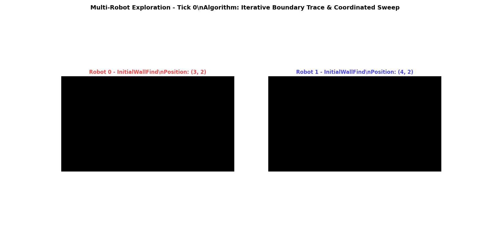

# Coordinated Multi-Robot Exploration

A high-performance Rust simulation implementing the **"Iterative Boundary Trace & Coordinated Sweep"** algorithm for autonomous multi-robot exploration and mapping of unknown 2D environments.

## 🚀 Overview

This project tackles one of robotics' fundamental challenges: **coordinated exploration under communication constraints**. Two autonomous robots collaborate to systematically map unknown environments using a novel phased exploration strategy that balances efficiency with robust coordination.

**Key Innovation**: Our algorithm solves the explore-vs-coordinate dilemma through iterative boundary scouting with progressive depth increase, ensuring complete coverage while maintaining communication coordination.

### The Problem: Coordinated Exploration Under Constraints

The algorithm is designed to solve the following problem:

Objective: A team of two autonomous robots must collaboratively explore and create a complete map of an unknown 2D environment.
Initial Conditions: The robots begin adjacent to each other at a single, arbitrary starting location. They possess no prior map information.

Environment: The space is represented as a 2D grid containing obstacles of arbitrary size, shape, and complexity (e.g., non-convex structures, dense clusters).

Primary Constraint: The robots have a limited communication range (R). They can only exchange data, such as their individual map discoveries and future plans, when they are within this range of each other.
The goal is to develop a comprehensive strategy that enables the robots to efficiently and completely map the entire connected area while operating under these conditions.

## The Challenge
The specific constraints of the problem lead to several key challenges that the algorithm must overcome:

The Explore-vs-Coordinate Dilemma: The limited communication range creates a fundamental tension. To explore new areas quickly, robots must move apart, but to coordinate effectively and avoid redundant work, they must remain close enough to communicate.
Scalability in the Unknown: Without knowing the environment's size beforehand, a naive exploration strategy could lead to robots getting lost on extremely long paths or becoming permanently separated.
Information Asymmetry: For periods when the robots are out of communication range, each robot will build a different map of the world. The algorithm must have a robust strategy for merging this information and reconciling different worldviews upon reconvening.

Ensuring Completeness: The strategy must guarantee that no areas are missed, requiring systematic methods to handle complex features like large open spaces, non-convex "courtyards," and dense clusters of obstacles that can act as mazes.

## The Algorithm: Iterative Boundary Trace & Coordinated Sweep
Our solution is a deterministic, multi-phase algorithm designed to address these challenges systematically.

### Phase 1: Initial Wall Discovery
The exploration begins with the two robots moving in a coordinated fashion from their starting point until they encounter the first major obstacle or boundary wall. This establishes an initial anchor point for the mapping process.

### Phase 2: Iterative Boundary Scouting
To avoid committing to a potentially massive and time-consuming perimeter trace, the robots first scout the boundary iteratively:

Starting with a small search depth n, the two robots follow the wall in opposite directions for n steps.
They then perform a local scan by retracing a path adjacent to the one just taken to reconvene, share map data, and synchronize. This frequent reconvening is key to managing the limited communication range.
The search depth n is progressively doubled for subsequent scouting missions.
This phase continues until the robots meet, having successfully traced a complete, closed loop. This adaptive approach ensures that large perimeters are explored incrementally without risk of over-commitment.

### Phase 3: Loop Analysis (Island vs. Outer Wall)
Once a loop is closed, the robots analyze it to determine if they have mapped an internal "island" (an obstacle cluster) or the true outer boundary of the area. This is achieved by analyzing the geometry of the traced path and the contents of the map inside versus outside the loop. If an island is detected, the robots use their last known heading to "escape" the island and continue searching for the true outer wall.

### Phase 4: Coordinated Interior Sweeps
With the boundary confirmed, the robots begin the final mapping phase:

- **Frontier-based exploration**: Robots collaboratively sweep the interior space by moving inwards from the known frontier
- **Coordinated movement**: They move in coordinated "opposite directions," ensuring systematic coverage  
- **Periodic synchronization**: Robots periodically meet to merge their maps and plan the next inward sweep on the new, smaller frontier
- **Complete coverage**: This process repeats until the entire interior is mapped

## ✨ Key Features

- **🔄 Adaptive Exploration**: Uses iterative deepening ("scouting missions") to safely probe large environments
- **📡 Communication-Aware**: Frequent rendezvous points designed for limited communication range constraints  
- **📋 Systematic Coverage**: Deterministic phases ensure complete environment mapping
- **🤝 Explicit Coordination**: Planned rendezvous points for map merging and re-synchronization
- **🏝️ Robust Island Handling**: Advanced logic to detect and navigate around complex internal obstacles
- **⚡ High Performance**: Written in Rust for memory safety and optimal performance
- **🎯 Trait-Based Architecture**: Modular phase system for extensibility and maintainability

## 🛠️ Implementation Highlights

- **Wall-Following Algorithms**: Left/right-hand rule implementations with collision avoidance
- **Boundary Analysis**: Rotation-based detection to distinguish islands from exterior walls  
- **Real-time Visualization**: Interactive eGUI interface showing robot movement and mapping progress
- **Configurable Scenarios**: Multiple map formats with customizable starting conditions
- **Comprehensive Testing**: Unit tests covering core algorithms and edge cases

## 🚀 Quick Start

### Prerequisites
- Rust toolchain (1.70+)
- Git

### Installation & Usage

```bash
# Clone the repository
git clone https://github.com/aaholmes/multiagent-explore.git
cd multiagent-explore

# Build the project
cargo build --release

# Run simulation with different scenarios
./run_simulation.sh                                    # Default: sample room
./run_simulation.sh --map_file maps/island_room.map   # Island detection demo  
./run_simulation.sh --map_file maps/l_shaped_room.map # Complex geometry
./run_simulation.sh --seed 123                        # Reproducible run

# Run tests
cargo test
```

### Available Maps
- `sample_room.map` - Basic room with scattered obstacles
- `simple_corridor.map` - Long corridor for boundary tracing
- `island_room.map` - Room with central island obstacle  
- `l_shaped_room.map` - Non-convex geometry testing

## 🎮 Simulation Demo

### Live Exploration Visualization

The simulation automatically launches an **interactive eGUI visualization** showing:
- **Robot positions** (`R`) moving dynamically through the environment
- **Progressive map discovery** as unexplored areas (` `) become explored (`.`)
- **Phase transitions** clearly labeled in console output
- **Coordination events** when robots communicate and synchronize

> 💡 **Tip**: The visualization window shows the complete exploration history with step-by-step robot movement and map discovery. Use the interactive controls to replay and analyze the algorithm behavior in detail.

### Demo Scenarios

**🚀 Quick Demo** - Run all scenarios:
```bash
./demo.sh
```

**Individual Scenarios:**

**Basic Room Exploration** (`maps/sample_room.map`)
```bash
./run_simulation.sh --seed 42
```
Demonstrates the complete 4-phase algorithm with obstacle avoidance and coordinated sweeping.

**Corridor Boundary Tracing** (`maps/simple_corridor.map`)  
```bash
./run_simulation.sh --map_file maps/simple_corridor.map --seed 42
```
Shows efficient boundary discovery and rapid completion in simple environments.

**Island Detection** (`maps/island_room.map`)
```bash
./run_simulation.sh --map_file maps/island_room.map --seed 42  
```
Highlights the algorithm's ability to distinguish interior obstacles from exterior boundaries.

### Key Visualization Features
- **Real-time robot positions** and orientations
- **Progressive map discovery** visualization  
- **Phase transitions** and coordination events
- **Final complete maps** with coverage statistics
- **Interactive eGUI interface** for detailed exploration analysis

### 🎬 Algorithm in Action

**Complex Room Exploration Demo** - Watch the complete 4-phase algorithm in action:



*The animation shows both robots' individual maps side-by-side with a "fog of war" effect as they execute the full "Iterative Boundary Trace & Coordinated Sweep" algorithm. Each robot progressively discovers the environment (black=unexplored, light gray=explored empty space, dark gray=obstacles, colored squares=robot positions). Notice how their explored areas gradually expand and become identical as they share information during rendezvous points.*

### Example Results

**Corridor Exploration** (34 ticks, complete coverage):
```
Initial State:          Final State:
    ##                   ##########
   .R..         →       #..........#
    ..                  #..........#
                        #.....R....#
                         ##########
```

**Algorithm Performance**:
- ✅ **Complete Coverage**: All accessible areas systematically mapped
- ✅ **Efficient Coordination**: Robots maintain communication throughout exploration  
- ✅ **Phase Progression**: InitialWallFind → BoundaryScouting → BoundaryAnalysis → InteriorSweep → Complete
- ✅ **Deterministic Behavior**: Reproducible results with same seed values

## 🔬 Algorithm Details

### Core Architecture
```
src/robot_node/
├── phases/           # Modular phase implementations
│   ├── wall_find.rs     # Phase 1: Initial wall discovery
│   ├── boundary_scouting.rs # Phase 2: Iterative boundary exploration  
│   ├── boundary_analysis.rs # Phase 3: Island vs exterior detection
│   └── interior_sweep.rs    # Phase 4: Final interior mapping
├── wall_following.rs # Left/right-hand rule algorithms
└── mod.rs           # Main robot coordination logic
```

## 🚀 Future Enhancements

The following features represent natural extensions to the current implementation:

- **Central Island Preprocessing**: Intelligent obstacle discovery before interior sweeps
- **Dynamic Communication Ranges**: Adaptive range based on environment complexity
- **Multi-Robot Scaling**: Extension to 3+ robot teams
- **ROS2 Integration**: Real-world deployment capabilities
- **Performance Optimization**: GPU-accelerated path planning

## 📄 License

This project is licensed under the MIT License - see the [LICENSE](LICENSE) file for details.

## 🤝 Contributing

Contributions are welcome! Please feel free to submit a Pull Request. For major changes, please open an issue first to discuss what you would like to change.

## 📚 Citation

If you use this work in your research, please cite:
```bibtex
@software{multiagent_explore,
  author = {Holmes, Adam A.},
  title = {Coordinated Multi-Robot Exploration: Iterative Boundary Trace & Coordinated Sweep},
  url = {https://github.com/aaholmes/multiagent-explore},
  year = {2024}
}
```
